# Electoral Roll Extractor

> Extract, process, and structure voter information from electoral roll PDFs with high accuracy.

This tool automatically extracts voter information from scanned electoral roll PDFs and converts it into structured data formats (CSV/Excel) for easy analysis and use.

### System Workflow


## Key Features

- **Automated Data Extraction** - Extract voter details from PDF electoral rolls
- **Image Enhancement** - Pre-processing for improved OCR accuracy  
- **Watermark Removal** - Clean scanned documents automatically
- **Structured Output** - Organized data in CSV/Excel format
- **Easy Configuration** - Customizable for different electoral roll formats

## Technology Stack

```mermaid
flowchart LR
    A[Electoral Roll Extractor] --> B[Image Processing]
    A --> C[OCR Engine]
    A --> D[Data Processing]
    A --> E[I/O Handling]
    
    B --> B1[OpenCV • NumPy • Pillow]
    C --> C1[Tesseract • PyTesseract]
    D --> D1[Pandas • RegEx]
    E --> E1[PDF2Image • Poppler]
    
    style A fill:#f5b041,stroke:#333,stroke-width:2px
    style B fill:#82e0aa,stroke:#333,stroke-width:1px
    style C fill:#85c1e9,stroke:#333,stroke-width:1px
    style D fill:#bb8fce,stroke:#333,stroke-width:1px
    style E fill:#f7dc6f,stroke:#333,stroke-width:1px
```



## 📋 Requirements

- Python 3.7+
- Tesseract OCR
- Poppler utilities
- `opencv`

### Installation

```bash
# Clone the repository
git clone https://github.com/yourusername/electoral-roll-extractor.git
cd electoral-roll-extractor

# Install dependencies
pip install -r requirements.txt

# Install Tesseract OCR and Poppler (system-specific)
# Windows: Download from respective websites
# Linux: sudo apt install tesseract-ocr poppler-utils
# macOS: brew install tesseract poppler
```

### Configuration

Update paths in `config.py` to match your environment:

```python
# Adjust these paths according to your system
TESSERACT_CMD = r'C:\Program Files\Tesseract-OCR\tesseract.exe'
POPPLER_PATH = r'path\to\poppler\bin'
```

## 🔍 How It Works


### Project Structure

```
electoral-roll-extractor/
├── config.py                  # Configuration settings
├── main.py                    # Main entry point
├── requirements.txt           # Dependencies
├── extractor/
│   ├── __init__.py
│   ├── image_processor.py     # Image processing functions
│   ├── text_extractor.py      # OCR and text extraction
│   ├── data_processor.py      # Data processing and formatting
│   └── utils.py               # Utility functions
└── data/                      # Data directory for input/output
    ├── input/                 # Input PDF files
    ├── output/                # Processed data output
    └── debug/                 # Debug images and logs
```
